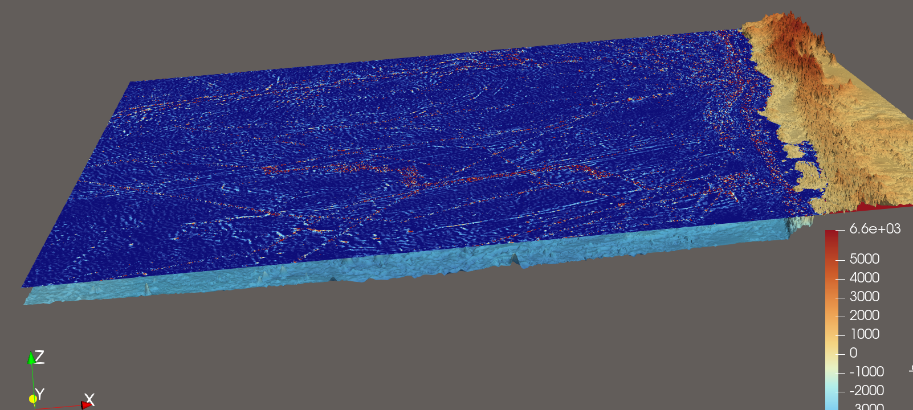
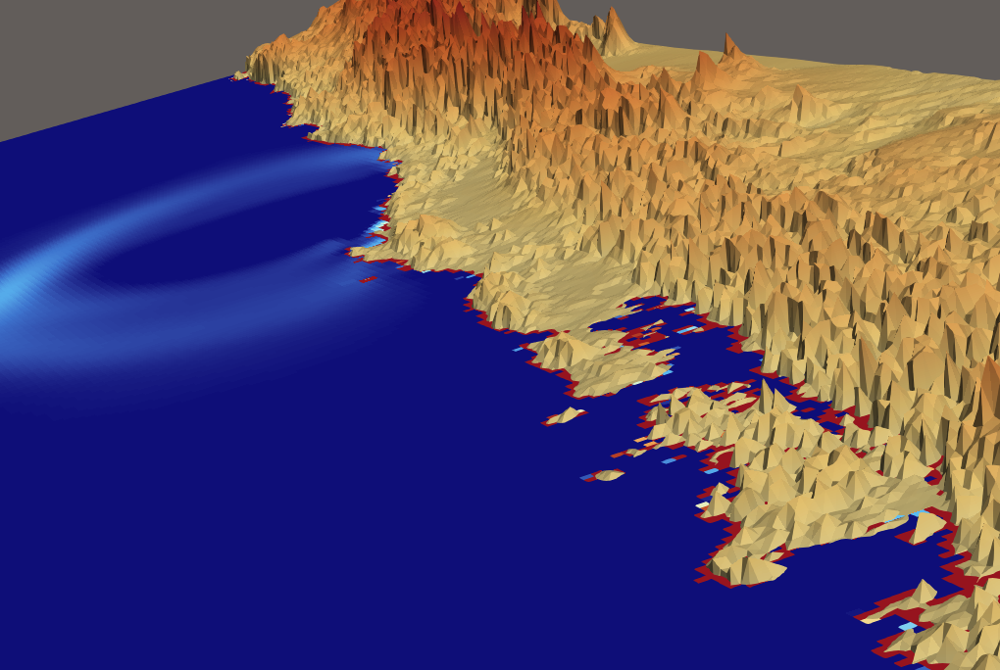

===================
Tsunami Lab Week 11
===================

Additions and Bug Fixes in Adaptive Grid Wave Propagation
-------------------------------------------------------------------------

This week, we focused on fixing critical numerical instabilities and initialization errors within the adaptive grid wave propagation implementation.

Proper Fine Grid Initialization
^^^^^^^^^^^^^^^^^^^^^^^^^^^^^^^
Fine cells are now correctly initialized with high-resolution values based on their exact local coordinates. Previously, the entire fine grid was incorrectly filled with the uniform value of its parent coarse cell, which negated the benefits of the refinement.

Boundary Instabilities over Uneven Bathymetry
^^^^^^^^^^^^^^^^^^^^^^^^^^^^^^^^^^^^^^^^^^^^^
A severe numerical bug occurred at the boundaries between coarse and fine grids. The simulation produced unphysical water spikes on water that was not moving. 

This was caused by an incorrect variable exchange between the grid levels. We were interpolating and restricting the water column height (:math:`h`) instead of the absolute surface elevation (:math:`\eta = h + b`). Because the coarse and fine grids have different bathymetries, passing :math:`h` directly created artificial gradients in the water surface. The solver misinterpreted these underlying bathymetry differences as real waves, causing the water to pile up.

   
   Bugged simulation on a 500 by 500 grid (Chile) 

The Solution
^^^^^^^^^^^^
To solve the issue, we modified the boundary interpolation and restriction methods to always exchange the absolute water surface (:math:`\eta`). The new water height (:math:`h`) for any given cell is now correctly derived by subtracting its local bathymetry from the passed surface elevation. This ensures that the numerical water surface remains perfectly flat over uneven terrain, preventing artificial wave generation.

Momentum Inside Dry Cells
^^^^^^^^^^^^^^^^^^^^^^^^^
Another critical error became visible at the coastlines (the wet/dry boundaries). When a cell falls completely dry (water height :math:`h \approx 0`), it can incorrectly retain a small amount of residual momentum (:math:`hu`).

   
   The simulation failing due to wrong velocities at the dry coastline cells.

**The Fix:**
To solve this, we introduced a strict wet/dry safety check. Whenever a cell's water height drops below a very small threshold, its momentum is explicitly forced to ``0.0``. This ensures that dry land remains physically still and prevents the velocity calculations from being incorrect.

.. toctree::
   :maxdepth: 2
   :caption: Contents:
