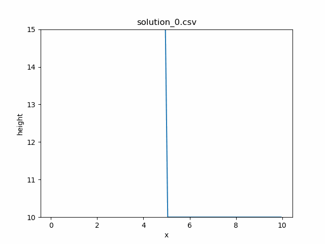
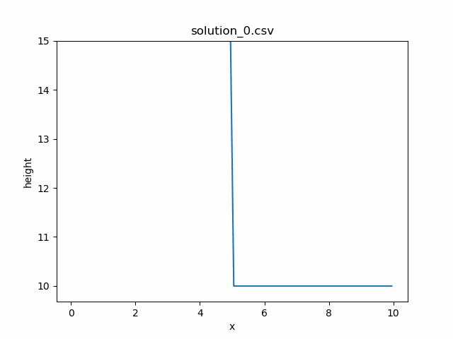
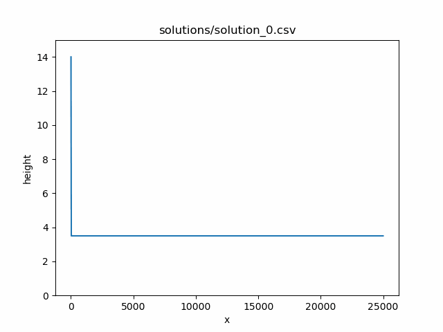

Tsunami Lab Week Two
=======================

Project Report
-----------------

Creating setups for rare-rare and shock-shock problems
~~~~~~~~~~~~~~~~~~~~~~~~~~~~~~~~~~~~~~~~~~~~~~~~~~~~~~~~~~

To implement both the Shock-Shock and the Rare-Rare -wave problems we can mostly reuse the template of the given Dambreak-problem files.
Mathematically both setup-problems are just inversions of each other since, in the shock-shock problem both waves move towards each other,
and in the rare-rare problem both waves move away from each other. This can be used in the code by finding the point of impact between the waves 
in the shock-shock problem and making sure that momentum values move towards this point. In the rare-rare problem this is inverted
and the momentum moves the waves away from the middle point between the waves. 
The exact impact "point" of both waves is *technically* not even at i_x but at the immediate boundary of i_x 
(to its left or right, depending on the if-statement) and it is in fact, not a real point in the space at all.
Therefore these *middle-points* between the waves are just one of the two discrete points bordering the actual middle, which itself is just the boundary betwenn the two *middle-points*. 
Following the instructions laid out in the given tasks, the setups both include only one height value (which is the same for both sides) and one momentum value 
(which is either negative or not depending on the circumstances mentioned earlier) and lastly the location of the middle-/impact-point of both waves.

Most of the tests implemented include the possibility to introduce a second dimension as input-values (y-coordinates). 
These inputs are currently unused and any actual values in these places don't change the output at all, since we are *currently* only working in one dimension (that might be why the files end on "1d")

To answer the question from 2.1.2.: yes there is a connection to the wave speeds.
𝜆1/2 =𝑢 ∓ √𝑔⁡ℎ, the formula has two main parts: 
   - 𝑢 is essentially the current velocity of the water itself 
   - and √𝑔⁡ℎ is the new wave adding or subtracting its speed from the water movement. 
Now if we look at the values we input into the calculation:
   - by increasing the height of the water (effectively increasing √𝑔⁡ℎ), we increase the strength of the waves and therefore both fronts of the water travel faster in their respective directions (apart from each other)
   - if we change 𝑢, we apply the same directional force to both wave fronts which means:
      - if 𝑢 is positive, the wave traveling right is sped up, while the one traveling left is slowed down
      - if 𝑢 is negative, the wave traveling right is slowed down, while the one traveling left is sped up
      - if the power of 𝑢 is greater than the waves directional power then the respective wave's direction inverses (if the wave moves left at 2 m/s but the water itself moves right at 7 m/s, the water still moves right just at 5 m/s)

Dam-Break
~~~~~~~~~~~~~~~~~~

Running the dam-break setup multiple times with different values for the water heights showed that the side with the higher water level takes longer to flatten out.
The bigger the difference between the two water levels, the longer it takes for the system to flatten out. 
Also the rarefaction wave and the shock wave can be observed. 

Dam-break simulation with heights 15 and 10 and u_r = 0.

Dam-break simulation with heights 15 and 10 and u_r = 5.

Adding a velocity to the shallow water the overall volume of water decreases. The higher the velocity, more water is moved out of the simulation. 
This probably occurs because the water moves to the right, so that it flows "out of the screen".
When a velocity of 5 is applied on the right side, the water flows faster than the simulation can redistribute the water. Using tests, this happens if the velocity is higher than 4.
 
Time to evacuate the village:
The simulation ran with the following paramters (changed localy in the file, not pushed to the repository):
q_l         = [14, 0]
q_r         = [3.5, 0.7]
l_endTime   = 2500
l_nx        = 1000 cells
l_dxy       = 25.0 / l_nx                        (using 25m for quicker simulation)
l_dt        = 0.5 * l_dxy * 1000 / l_speedMax    (Time for each timestep, l_dxy gets converted into meters)
            = 0.5 * (25000 / 1000) / sqrt( 9.81 * 14 ) = 1.0666243438523706 seconds per timestep

   Simulation for the village task.

Every solution shows the update of 25 timesteps. The Wave hits the village in solution_86.csv after about 25 * 86 = 2150 timesteps. 
This means the village has about 1.066 * 2150 = 2291.9 second or 38.20 minutes to evacuate.

.. toctree::
   :maxdepth: 2
   :caption: Contents:

