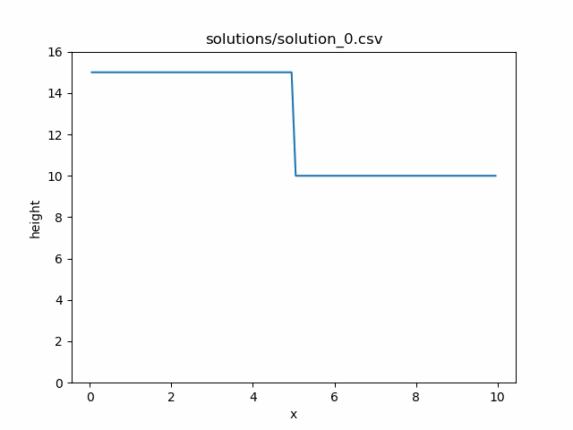
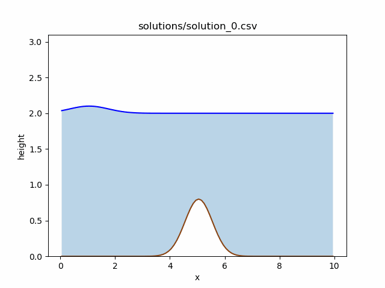
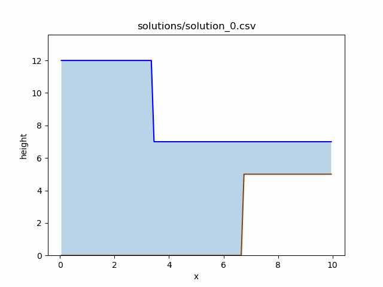
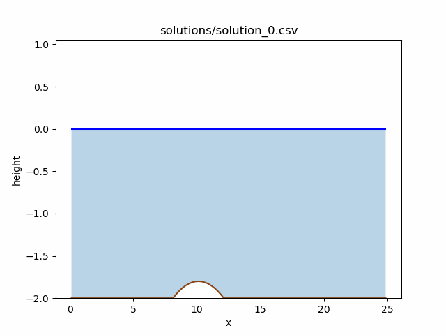
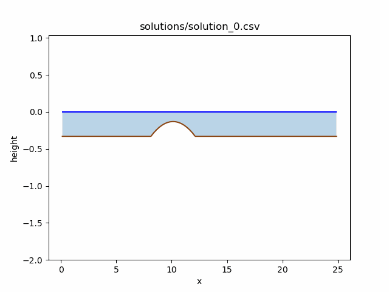
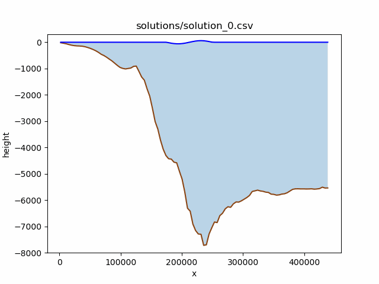
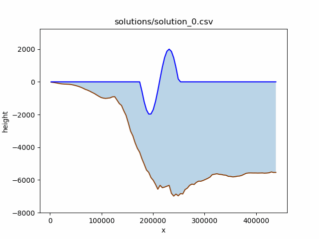

Tsunami Lab Week Three
=======================

Project Report
-----------------

Solver Bathymetry 
~~~~~~~~~~~~~~~~~~~~~

First we implement the basic support for bathymetry by following the given formulas and adding them into the f-wave solver.
The change can be directly included in the flux-calculation (3.1.1) and is determined by Δ⁢𝑥⁢Ψ𝑖−1/2(3.1.2).
Bathymetry values also need to be included for ghost-cells in the wave-propagation patch, along with further changes 
to implement the reflecting bevavior for task 3.2.

To illustrate the effects of the bathymetry, in this example we can see the bathymetry at work.
Here we can see a wave of water moving to the right, impacting on the raised floor, which reflects a much smaller wave back in the opposite direction.

Bathymetry example with dam at 3.3m(1/3) and change in floor height at 6.6m(2/3).

Another example would be a simple subcritical flow with the water moving left to right at constant momentumm and a small wave piled up on the left.
The scenario reaches an equilibrium with water above the raised floor being slightly lower but faster.
This looks weird, but is mathematically correct.

Bathymetry example with a bump (gaussian) at the middle with a maximium floor height of 0-8m and a width of 0.5m.

Boundary Reflections
~~~~~~~~~~~~~~~~~~~~~~~

The basic idea of the reflecting boundary cells is very simple: if a boundary cell is wet, the outflow should behave like it already was.
If it is dry, it should reflect the wave exactly like in a shock-shock scenario.
The implementation is a bit more difficult, since we now have to track the dry/wet or outflow/reflecting states of both boundary cells individually.
Currently the reflecting states are implemented in a way that sets a boundary cell to reflecting, if the depth of the water of the
immediate inner neighbour is less than 5m (can easily be changed).

In an actual example we can see the wave being reflected, just like a shock-shock setup.
The example essentially shows 12m deep water filling a pocket of 2m deep water on a 5m high plateau.

   Example for reflecting boundary

Subcritical and Supercritical Flow
-------------------------------

Calculating the Location and Value of the Maximum Froude Number
~~~~~~~~~~~~~~~~~~~~~~~~~~~~~~~~~~~~~~~~~~~~~~~~~~~~~~~

The Froude number is defined as:

.. math::

   F = \frac{u}{\sqrt{g \cdot h}}

Since the momentum is constant (at :math:`t = 0`), we get the maximum Froude number where the height of the water is the lowest.

The lowest water height can be found at the top of the obstacle, which is at:

.. math::

   x = 10

Subcritical Flow
~~~~~~~~~~~~~~~~

Height of the water at :math:`x = 10` is:

.. math::

   h = 1.8

The Froude number is computed as:

.. math::

   F = \frac{4.42 / -b(10)}{\sqrt{g \cdot -b(10)}}

with:

.. math::

   b(10) = -1.8

Result:

.. math::

   F = 0.5844578200955863

Supercritical Flow
~~~~~~~~~~~~~~~~~~

Height of the water at :math:`x = 10` is:

.. math::

   h = 0.13

The Froude number is computed as:

.. math::

   F = \frac{0.18 / -b(10)}{\sqrt{0.5844578200955863 \cdot -b(10)}}

with:

.. math::

   b(10) = -0.13

Result:

.. math::

   F = 5.02320

Simulation Results
-------------------

We implemented a new hydraulic jump setup. The values that do not change between the subcritical (3.3.1) and supercritical flow (3.3.2) 
are hardcoded into the setup file, while the values that change can be specified as agrguments inside main.cpp.

   Subcritical Flow

   Supercritical Flow

The hydraulic jump can clearly be observerd in the supercritical flow, at about x = 12.
The f-solver fails to converge because the momentum does not stay constant across the entire domain,
as seen in the following output file (solution_11.csv).

.. code-block:: text

   x,y,bathymetry,height,momentum_x
   ...
   10.875,0.125,-0.158125,0.0803511,0.124853
   11.125,0.125,-0.18,0.0719677,0.124853
   11.375,0.125,-0.208125,0.0648907,0.124853
   11.625,0.125,-0.2425,0.154886,0.156509
   11.875,0.125,-0.283125,0.254801,0.124857
   12.125,0.125,-0.33,0.305365,0.124857
   12.375,0.125,-0.33,0.305365,0.124857
   12.625,0.125,-0.33,0.305365,0.124858
   12.875,0.125,-0.33,0.305365,0.124858
   13.125,0.125,-0.33,0.305365,0.124858
   13.375,0.125,-0.33,0.305365,0.124859
   13.625,0.125,-0.33,0.305365,0.124859
   13.875,0.125,-0.33,0.305365,0.124859
   14.125,0.125,-0.33,0.305365,0.12486
   14.375,0.125,-0.33,0.305365,0.12486
   14.625,0.125,-0.33,0.305365,0.12486
   14.875,0.125,-0.33,0.305365,0.12486
   15.125,0.125,-0.33,0.305365,0.12486
   15.375,0.125,-0.33,0.305366,0.124861
   15.625,0.125,-0.33,0.305366,0.124861
   15.875,0.125,-0.33,0.305366,0.124861
   ...

The Tsunami Simulation
~~~~~~~~~~~~~~~~~~~~~~~~~~

Following the mathematical formulas laid out in (3.4.2) the new setup creates a one-dimensional tsunami-simulation based on the 
bathymetry data, that was cut out of the GEBCO_2025.nc dataset or DEM. Specifically it takes a slice of seafloor on the coast 
of Japan as a line between the two points 𝑝1 =(141.024949,37.316569) and 𝑝2 =(146.0,37.316569), with a 250m distance between each point.

The check for the boundary cells is now hard-coded to set the respective cells to reflect waves if the depth of the water
on the edges of the simulation is at or below 20 metres.

   an attempt at tsunami simulation with triple the height of the wave

After many unexpected Problems (for example: the ocean draining within seconds or distances in the .csv being in kilometers, while they are in meters everywhere else)
this is the first somewhat reasonable simulation achieved (with ./build/tsunami_lab -S TsunamiEvent1d -w 50000 -t 2000).
Something is still clearly wrong with the waves disappearing as they approach the shore, but i suspect this has something to do with the very large timesteps
that are set at the beginning of the simulation itself. This is despite increasing the displacement by 200%, since the results with original values were barely visible.

The new simulation uses a 100 times stronger tsunami wave, that now reaches the shore and gets reflected.

   an attempt at tsunami simulation with 100 times the height of the wave

.. toctree::
   :maxdepth: 2
   :caption: Contents: