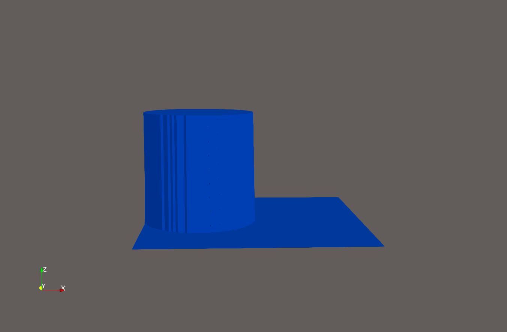
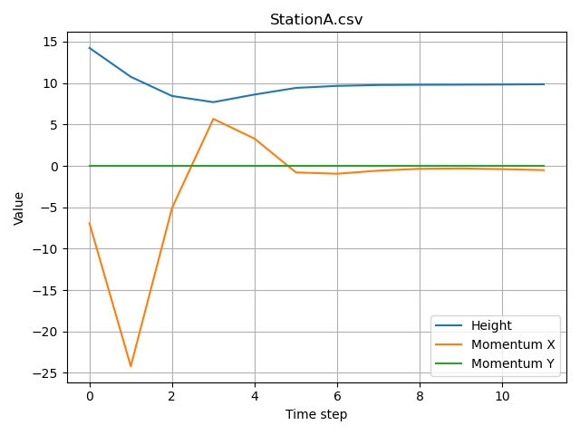
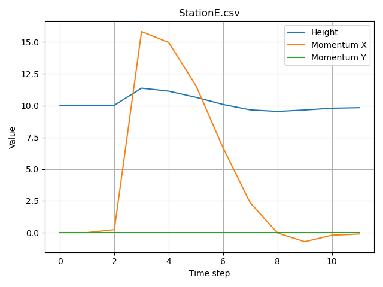

Tsunami Lab Week 4
=======================

Project Report
-----------------

Implementing 2-Dimensional Simulation
~~~~~~~~~~~~~~~~~~~~~~~~~~~~~~~~~~~~~~~~~~~~~

To implement the 2-dimensional simulation, we first need to write a new patch that allows us to 
run the f-wave solver multiple times on the same data. This can be achieved by essentially storing the
states of every cell, then applying the solver on slices in x-direction and seperately storing the changes,
then running the the solver in y-direction and adding the resulting changes to the ones from the x-direction.
These changes can then be applied to the cells to create the new timestep and the simulation then continues
with the new timestep as a basis.

A large portion of the work for this task comes from implementing the needed changes into the main function and
making sure everything still works afterwards since the entire simulation always consists of atleast: 
calling the main function, using a setup, running a patch and applying a solver.

To display the new 2-D simulation, we use ParaView to apply filters to the output- *.csv-files* 
to create an animation going through the simulated timesteps. 
The specified 2-dimensional-dambreak looks like this:

.. raw:: html

   <video width="740" height="700" controls>
     <source src="_static/2ddambreak.mp4" type="video/mp4">
   </video>

Most notably the waves look unnatural, probably due to the fact that we only simulate in two directions
and therefore the diagonal waves move differently. The coloring applied to the water represents the combined
momentum in both directions, which *in my opinion* shows the movements better than just one of the two.

To showcase the bathymetry, the newer simulation contains some changes on the ground which has measurable, 
but small impacts on the overall simulation. The largest difference is in the time it takes the waves to leave
the simulated area and with what speed. Without bathymetry they all exit the simulation at the sam time due to
the area being a square, but with bathymetry that changes. It also introduces more weird momentum-areas along
the underwater cliffs in addition to the directional ones forming from the dambreak itself.

.. raw:: html

   <video width="740" height="700" controls>
     <source src="_static/2dbathymetry.mp4" type="video/mp4">
   </video>

Stations
~~~~~~~~~~~~~~~~~~~~~

Each station has a position defined by x and y coordinates, as well as a unique name for identification. All stations share the same recording interval.
The output files are stored in the folder ``solutions/station_data``. Each file is named after its corresponding station. The station class provides a public method ``timeStep`` which handles the recording of data.
The ``timeStep`` method is called within the main simulation loop. It uses ``l_dt`` to determine whether enough time has passed since the last recording. If so, a new data point is written; otherwise, it waits until the required interval is reached.
The generated CSV files can be converted into plots to visualize the recorded data by running ``python3 station_vis.py`` in the command line. The resulting images are saved in ``solutions/station_data/plots``.

.. figure:: t
   :width: 600px

   Example of recorded station data. The station was placed in the center of a RareRare1d setup.

The number of stations, their positions, the recording interval, and the output directory can all be configured in ``src/io/stations.xml``. Based on this configuration, instances of the station class are created.

::
   <tsunamilab>
      <stations>
         <station name="StationA" x="5" y="0"/>
         <station name="StationB" x="2" y="0"/>
      </stations>

      <output>
         <record_interval>0.1</record_interval>
         <path>solutions/station_data/</path>
      </output>
   </tsunamilab>

``stations.xml`` file

2D Circular Dambreak
~~~~~~~~~~~~~~~~~~~~~

The 2D dam break simulation was performed using a circular dam with a height of 15, centered at x = 2.5 and y = 5, and a radius of 2.5. This results in the rightmost point of the dam being located at x = 5.
This setup makes the 2D configuration comparable to the 1D version. Five stations were placed along the x-axis to record data from the 2D simulation. The resulting solution files were loaded into ParaView and converted into a GIF:

   New DamBreak2d simulation.

   Recorded data from a station located on the left side of the 2D dam break.

   Recorded data from a station located on the right side of the 2D dam break.

.. figure:: dambreak_15_10_5_100.gif
   :width: 600px

   Old DamBreak1d simulation.

Several clear differences can be observed between the 1D and 2D dam break setups. The 2D simulation behaves more like real water: the water from the dam collapses and spreads outward, pushing fluid toward the edges and generating multiple outward-propagating waves.
Typically, one dominant wave followed by smaller waves can be observed. In contrast, the 1D setup mainly results in a simple equalization of the water levels.
In the 2D setup, the final water height is slightly lower. This is likely because the dam does not occupy the entire left region, but instead only forms a circular section.

.. toctree::
   :maxdepth: 2
   :caption: Contents: