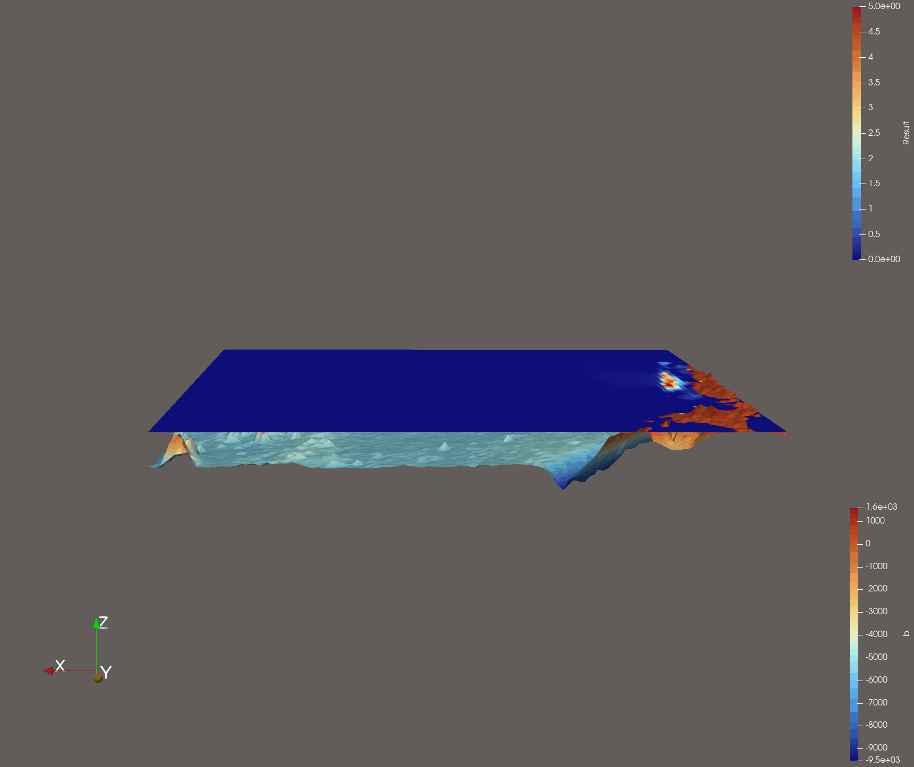
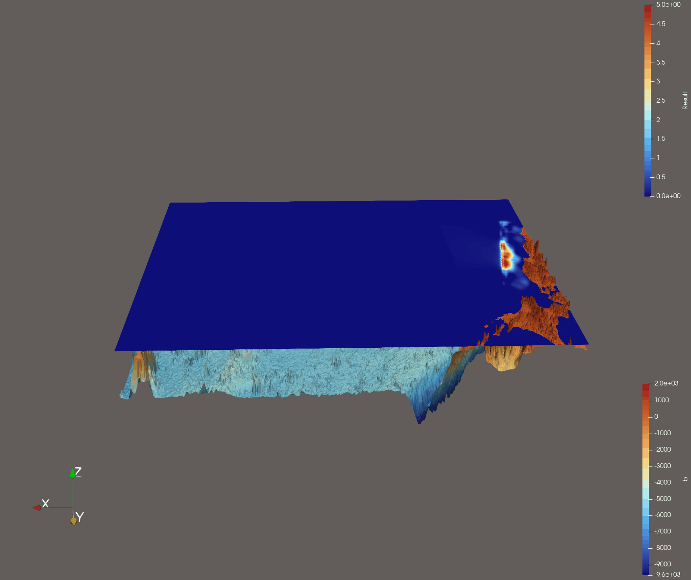

Tsunami Lab Week 4
=======================

Project Report
-----------------

Implementing the 2008 magnitude 8.8 Chile event
~~~~~~~~~~~~~~~~~~~~~~~~~~~~~~~~~~~~~~~~~~~~~~~~~~

A visualisation of the input data:

The simulation had to run for: 
before the first waves left the computational domain.

The computational demands are: 
    - number of required cells:
    - number of cell updates: 

Implementing the 2011 magnitude 8.8 Tohoku event
~~~~~~~~~~~~~~~~~~~~~~~~~~~~~~~~~~~~~~~~~~~~~~~~~~~

    Tohoku event visualisation of the input data with 250m resolution on a 100x100 grid.

    Tohoku event visualisation of the input data with 250m resolution on a 500x500 grid.

The 50m resolution version didnt work. After a short time of running the simulation, the consol outputed 'Killed'. Probably the simulation ran out of memory, since the 50m version has 100 times more cells than the 250m version.

The simulation had to run for: 0.406338
before the first waves left the computational domain. (Top Edge)

The computational demands are: 
    - number of required cells: 500 x 500 = 250000
    - number of cell updates: 25 time_steps x 250000 cells = 6250000 cell updates

The earthquake took place at 14:46 JST (UTC 05:46) around 67 kilometers from the nearest point on Japan's coastline, 
and initial estimates indicated the tsunami would have taken about 30 minutes to reach the areas first affected, 
and then areas farther north and south based on the geography of the coastline. 
Sõma, a coastal city in Fukushima Prefecture, experienced the devastating impacts and the Japan Meteorology Agency (JMA)
published their observations, including: *15:50 JST Sōma 7.3 meters or higher* (UTC 6:50). 
Tohoku University, in their paper "Tsunami arrival time characteristics of the 2011 East Japan Tsunami obtained from eyewitness accounts, evidence and numerical simulation"
mentions arrival time, in central Sõma, of 69 minutes after the Event. This matches the data of the JMA with only a few minutes difference.

To calculate the arrival time

.. toctree::
   :maxdepth: 2
   :caption: Contents: