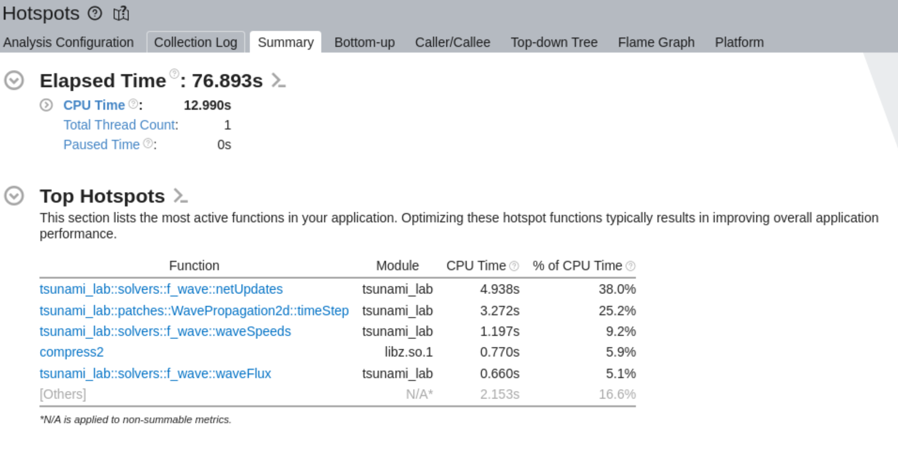
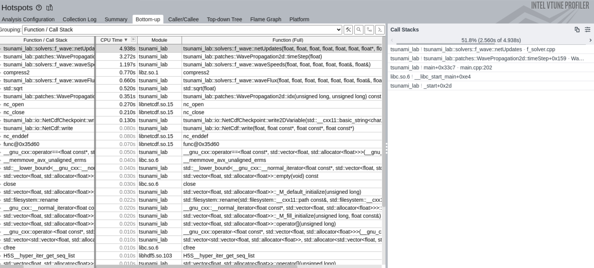
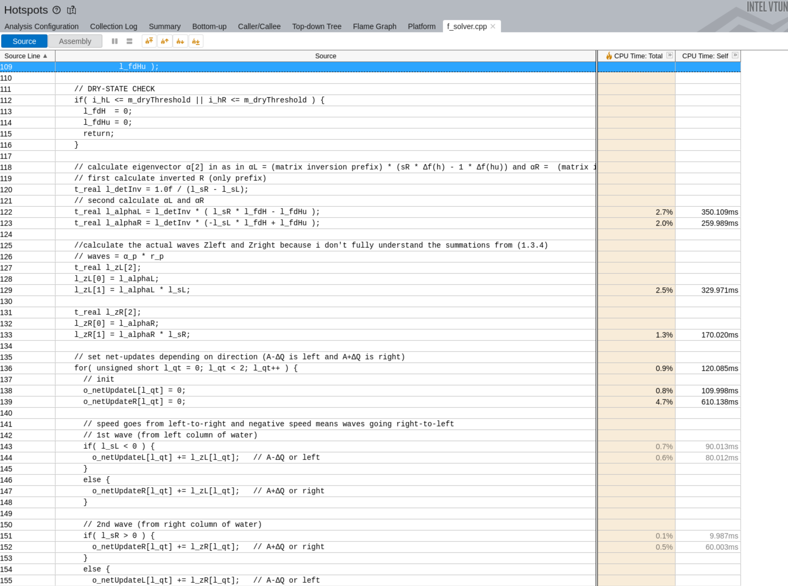
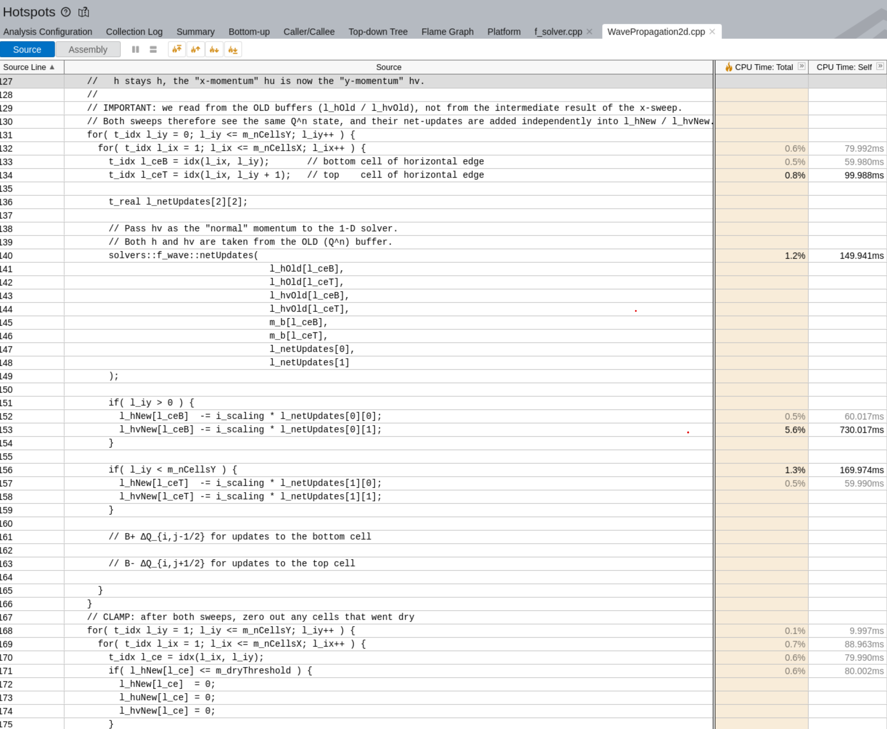

Tsunami Lab Week 8
=======================

Project Report
-----------------

Draco-Cluster and Performance measures
~~~~~~~~~~~~~~~~~~~~~~~~~~~~~~~~~~~~~~~~~~~~~~~~~~

Setting up the Draco-Cluster  was more complicated than first anticipated. First we needed to clone the Github and add the input-data from chapter 6.
The next part was installing scons with the tools/python/3.8 module. Next we needed to download PugiXml-support, since it was not installed on the cluster.
Then we needed to compile and archive it for the linker. Now we needed to expand the SConstruct file to actually link it correctly. And lastly
we neded a setup environment that would load all required modules and set the environment variables for Scons. Also we need to disable version-checking for hdf5, since it throws warnings.

After all of that the code can finally be compiled on the cluster itself.

To test and measure the time on both the cluster and the elaine-pc we added time measurements around the time stepping loop and additionaly 
measure the time the solver takes in each loop to add these times up. If we now compare the two recorded times, we can not only derive the percentage
of time that the solver takes in comparison to the entire simulation, we can also easily calculate the setup time and I/O overheads.

The measurements for the Chile-setup (for comparison ./build/tsunami_lab -S ChileEvent2d -n 8000 -t 90 ) are:
   - 53 936 000 cells (8000 * 6742)
   - time: 90s (118 time steps)
   - number of total cell updates: 6.364.448.000 (53936000 * 118)

For the elaine-pc we get the following measurements:
   - entire loop time: 174.867 seconds
   - solver-time: 94.7481 seconds
Which gives us:
   - about 80 seconds of overhead and I/O time 
   - 54.1831% of time is solver-time
      - ~0.80295 seconds per time step
      - ~1.5 E-8 seconds (15 nanoseconds) per cell update

For the draco cluster we get (live testing with salloc --partition=short):
   - entire loop time: 451.856 seconds
   - solver-time: 286.352 seconds
Which gives us:
   - about 165.5 seconds of overhead and I/O time 
   - 63.3724% of time is solver-time
      - ~2.43 seconds per time step
      - ~4.5 E-8 seconds (45 nanoseconds) per cell update

With these measurements, the elaine-pc is much faster which probably has to do with the fact that the simulation itself is not really
parallelized yet and therefore doesn't really benefit from the large amount of cores that are the clusters strength. It takes almost three times
as long on the cluster node.

Compilers
~~~~~~~~~~~~~~~~~~~~~~~~~~~~~~~~~~~~~~~~~~~~~~~~~~

VTune GUI
~~~~~~~~~

On Windows, it was necessary to install MobaXTerm to act as a local X server. 
It allows the GUI of VTune running on the cluster to be displayed on a Windows machine. 

Running The Analysis
....................

.. code-block:: bash

   module load intel/oneapi/2025.0.0
   export PATH=/cluster/intel/oneapi/2025.0.0/vtune/2025.0/bin64:$PATH

Run this command to clear the old analysis:

.. code-block:: bash

   rm -rf ~/Tsunami-Lab/vtune_result_hotspots*

**Slurm Batch Script:**

.. code-block:: bash

   #!/bin/bash
   #SBATCH --partition=short
   #SBATCH --nodes=1
   #SBATCH --ntasks=1
   #SBATCH --cpus-per-task=1
   #SBATCH --time=00:20:00
   #SBATCH --output=tsunami_sim_01.out
   #SBATCH --error=tsunami_sim_01.err

   cd /home/ke89mek/Tsunami-Lab

   source setup_env.sh

   export HDF5_DISABLE_VERSION_CHECK=2

   srun vtune -collect hotspots -r vtune_result_hotspots ./build/tsunami_lab -S TsunamiEvent2d -n 300 -t 100

``export HDF5_DISABLE_VERSION_CHECK=2`` had to be used since there was a small version mismatch that threw an error but could be safely ignored.

Open the VTune GUI:

.. code-block:: bash

   vtune-gui ~/Tsunami-Lab/vtune_result_hotspots &

SConstruct Modifications
........................

Added the following lines to the ``SConstruct`` file locally inside the project on Draco:

.. code-block:: python

   env.Append(CXXFLAGS=['-std=c++17', '-g', '-fno-inline'])
   env.Append(LIBS=['stdc++fs'])

Visualization & Evaluation
..........................

As expected, the f-wave solver and the ``timeStep`` method from ``WavePropagation2d`` take up most of the time, since the whole simulation mostly depends on the calculation between cells.

Unexpectedly, setting the ``netUpdateR`` array at an index to 0 takes up the most time inside the f-wave solver, while the same operation for ``netUpdateL`` takes up a lot less. 
Other than that, the rest of the performance mostly goes to multiplication operations.

In ``WavePropagation2d``, most of the performance goes to calculating the height and the momentum. 
Cache misses are probably the reason for that, since it accesses the 2D ``netUpdates`` array. 
The second thing is the index calculation and the ``if``-statement in line 156 having to be calculated and checked every iteration.

Optimisation
............

F-Wave Solver
  Instead of using a dedicated loop to reset the update arrays to zero before accumulation, the code can be restructured to perform a direct assignment (``=``) during the first wave calculation instead of an addition (``+=``). This completely removes the computational overhead of the initialization loop and reduces memory traffic.

  The conditional branches used to determine the direction of the waves can be replaced with branchless design patterns. By extracting the sign bit of the wave speeds using mask operations or functions like ``std::signbit``, the updates to the left and right states can be computed through pure mathematical expressions.

WavePropagation2d
  We can try changing the order of the ``for``-loops to achieve more cache hits.

  The branch instructions checking for grid boundaries can be removed from the main computational path by applying loop peeling. This handles the physical edges of the simulation grid in separate, dedicated loops.

.. toctree::
   :maxdepth: 2
   :caption: Contents: